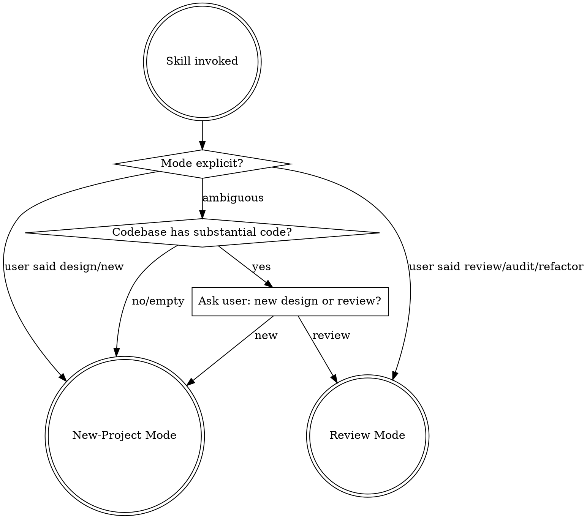

# Codebase Architecture

Design architecture for new projects or review existing codebases. Covers both macro (architectural patterns, module boundaries, dependency direction) and micro (design patterns within components) levels. Language-agnostic.

**Core principle:** Evidence before opinion. Read code before diagnosing. Name every pattern explicitly. Cite specific files and lines.

## When to Use

- "Review the architecture of this codebase"
- "How should I structure this new project?"
- "What design patterns are we using?"
- "Help me refactor these module boundaries"
- "Map the dependencies in this project"
- Codebase feels tangled, coupled, or inconsistent

**Not for:** Reviewing design documents (use `design-integrity-review`), bug hunting (use `find-bugs`), performance optimization.

## Mode Selection

---

## New-Project Mode

Structured dialogue that produces an architecture spec. **Do NOT design in silence** — ask questions, wait for answers.

### Phase 1: Understand the Domain

Before patterns or layers — understand what's being built:
- What does this system do? (one sentence)
- Who are the actors? (users, services, external systems)
- What are the 3-5 key operations?
- What are the hard constraints? (performance, team size, deployment, compliance)

**One question at a time.** Do not dump all questions at once.

### Phase 2: Identify Architectural Drivers

Surface forces that should *shape* the architecture:
- **Scale axis** — single user CLI vs multi-tenant SaaS vs embedded
- **Change axis** — what changes frequently vs remains stable?
- **Integration axis** — what external systems must this talk to?
- **Team axis** — how many people/teams? (Conway's Law)

These drivers determine which patterns are appropriate. A 500-line CLI does not need hexagonal architecture.

### Phase 3: Select Architectural Patterns

Using Phase 2 drivers, recommend macro-level patterns from `patterns-reference.md`:
- Overall structure (layered, hexagonal, event-driven, etc.)
- Communication style (sync, async, event sourcing)
- Data strategy (single DB, CQRS, shared-nothing)

**MUST present 2-3 options with trade-offs.** Recommend one with rationale tied explicitly to the drivers from Phase 2. Do not present a single approach as inevitable.

### Phase 4: Define Boundaries & Interfaces

The most important phase:
- Each module gets a clear responsibility (one sentence)
- Define interfaces between modules
- **Establish dependency direction** — which modules know about which? Dependencies should point toward stable abstractions, not toward volatile details.
- **Name the design patterns** that apply within each module (e.g., "plugin system uses Strategy", "event bus uses Observer"). Refer to `patterns-reference.md`.

### Phase 5: Produce Architecture Spec

Write structured document to `docs/architecture/architecture-spec.md` (or user's preference):
- System overview (one paragraph)
- Architectural drivers & constraints
- Module map with responsibilities
- Interface definitions
- Dependency graph (text-based, showing direction)
- Pattern decisions with rationale
- Risk areas & open questions

Ask user how they want to proceed — their planning workflow, direct implementation, or keep as reference.

---

## Review Mode

Scan-first, dialogue-second. **Read code before forming opinions.**

### Phase 1: Codebase Scan

Use available tools (code-intelligence MCP, grep, glob, file reads):
- **Dependency mapping** — trace imports/requires to build module dependency graph. Note direction and cycles.
- **Structure mapping** — directory layout, module boundaries, entry points
- **Size analysis** — identify oversized files/modules (signal of unclear responsibilities)
- **Pattern detection** — recognize patterns in use (repository classes, factory functions, event emitters, middleware chains)

**Do not skip this phase.** Do not rely on CLAUDE.md or README alone. Read actual source files.

### Phase 2: Architectural Health Assessment

Evaluate findings against these dimensions:

| Dimension | Check | Rating |
|-----------|-------|--------|
| **Dependency direction** | Do deps point toward abstractions or toward details? Circular deps? | strong / adequate / weak |
| **Module cohesion** | Single clear responsibility per module? | strong / adequate / weak |
| **Coupling** | Can you change one module without rippling? | strong / adequate / weak |
| **Boundary clarity** | Explicit interfaces, or modules reach into internals? | strong / adequate / weak |
| **Pattern consistency** | Same problem solved the same way everywhere? | strong / adequate / weak |
| **Abstraction quality** | Abstractions earn their keep? Leaky or unnecessary? | strong / adequate / weak |

**Distinguish intentional from accidental.** A codebase using 3 patterns for the same problem might be evolving. Flag inconsistency but ask before assuming it's a mistake.

### Phase 3: Health Report

Save to `docs/architecture/architecture-review-YYYY-MM-DD.md`:
- **Architecture overview** — what the structure actually is
- **Dependency graph** — text-based, showing direction and cycles
- **Pattern inventory** — each pattern named, where it's used, file:line references, consistency assessment
- **Smell inventory** — specific issues with severity (critical / warning / info)
- **Strengths** — what's working well and why. This section is mandatory.
- **Health score** — per-dimension rating table from Phase 2
- **Priority ordering** — what to fix first based on impact-to-effort

### Phase 4: Prescriptions

For each smell or weakness:
- What to change and why
- Which pattern to apply (reference `patterns-reference.md`)
- Impact estimate (how much code changes, risk of breakage)
- Priority (high / medium / low) with rationale

### Phase 5: Transition to Action

Present prescriptions and ask:
- Which fixes to pursue
- How they want to proceed (their planning skill, start executing, or keep the report)

---

## Guard Rails

**Evidence before opinion.** Read code before diagnosing. Use code-intelligence MCP tools, grep, glob — whatever is available.

**Name the pattern, cite the location.** "Strategy pattern in `src/providers/types.ts:24`" — not "you seem to use a strategy-like approach."

**Strengths matter as much as weaknesses.** A review that only lists problems is misleading. Call out what's well-structured.

**Don't prescribe patterns for their own sake.** Every recommendation answers: "What problem does this solve in this codebase?" If the answer is "best practice," that's not good enough.

**Scale to codebase size.** 500-line CLI? Don't recommend hexagonal architecture. 50-file project? Don't recommend CQRS. Actively resist over-engineering.

**Don't assume before asking.** In new-project mode, do not state 10 assumptions and build a full design. Ask, listen, then design.

## Common Mistakes

| Mistake | Fix |
|---------|-----|
| Designing without understanding domain constraints | Complete Phase 1-2 before Phase 3 |
| Presenting one architecture as inevitable | Always present 2-3 options with trade-offs |
| Using patterns but not naming them | Explicitly name every pattern by its standard name |
| Tracing module layout but not dependency direction | Map which modules import which and assess direction |
| Listing only problems in a review | Strengths section is mandatory |
| Over-engineering for a small codebase | Match pattern complexity to actual codebase scale |
| Assuming inconsistency is accidental | Ask before diagnosing — it might be intentional evolution |
